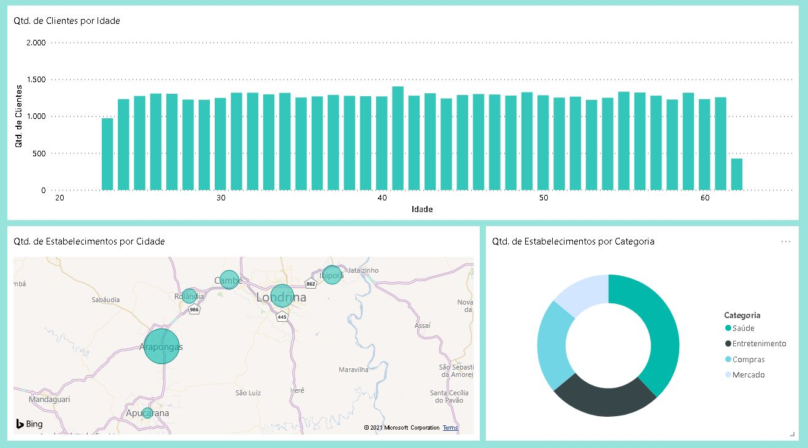

# sistema_blub
Projeto criado para simular, de forma simples, o sistema bancário do banco "Blub" com criação de cadastros de clientes, estabelecimentos, geração de transações, armazenamento de dados, geração de relatórios, etc.

# Scripts
gerador_de_clientes -> este script tem como função gerar o cadastro de um cliente fictício, com suas informações pessoais. A utilização do algorítmo "sha-256" tem como objetivo apenas simuladar o armazenamento criptografado de dados sensíveis como, por exemplo, CPF, Nª da Conta Bancária, Nº do Cartão de Crédito, etc. Apesar de não terem função prática dentro deste projeto, achei interessante incluir este recurso para um melhor entendimento de como este algorítmo funciona, além de gerar também uma maior quantidade de dados para serem armazenados e trabalhados posteriormente. Após a geração de todos os dados cadastrais, os mesmos são incluidos no Database "sistema_transacional" (criado utilizando MySQL) por meio do mysql.connector.

gerador_de_estabelecimentos -> este script tem como função gerar o cadastro de um estabelecimento fictício, com suas informações. Assim como no script acima, a utilização do algorítmo "sha-256" tem como objetivo apenas a simulação de um sistema real somada à uma maior quantidade de dados gerados. Após a geração de todos os dados cadastrais, os mesmos são incluidos no Database "sistema_transacional" por meio do mysql.connector.

gerador_de_transacoes -> este script tem como função gerar transações entre clientes e estabelecimentos fictícios. O fluxo de execução é o seguinte:

  geração de um ID aleatório para a transação -> seleção aleatória de um cliente por meio do mysql.connector e armazenamento das informações numa lista python -> seleção aleatória de um estabelecimento por meio do mysql.connector e armazenamento das informações numa lista python -> geração de um valor aleatório para a transação -> geração de uma data para transação -> geração de um horário para a transação (feito por um sistema de "weighted choice", baseado nos horários de pico do fluxo de transações numa organização real) -> geração da transação propriamente dita, executando as funções anteriores e incluindo as transações geradas no Database "sistema_transacional" por meio do mysql.connector.

# PowerBI
Após a geração da base dados de acordo com o descrito acima, utilizei o PowerBI para importar, tratar e analisar todos os dados, gerando assim dashboards intuitívas para fácil análise do sistema como um todo.

